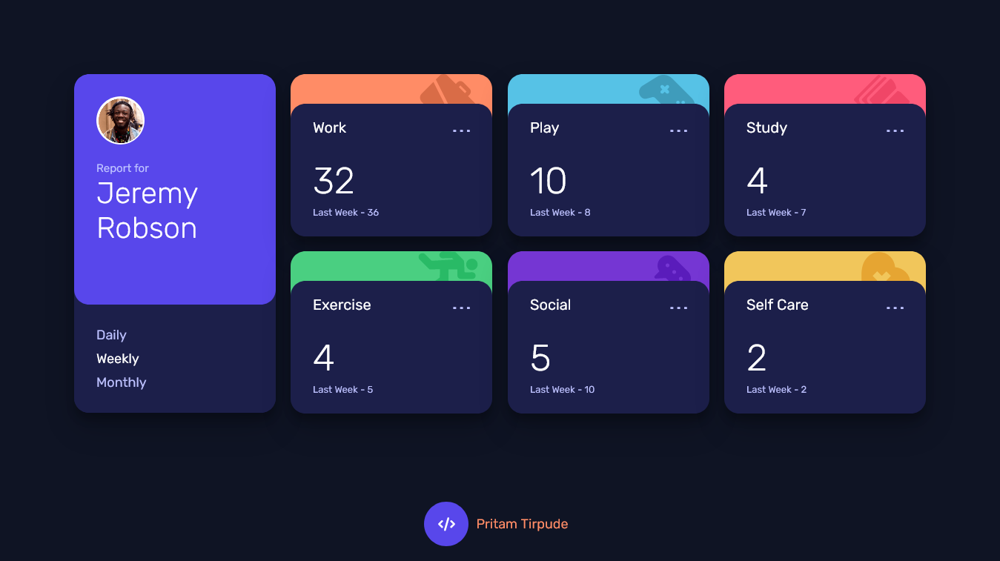
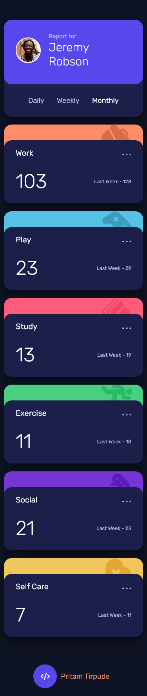

# Frontend Mentor - Time tracking dashboard

## Welcome! 👋

Thanks for checking out this front-end coding challenge.

[Frontend Mentor](https://www.frontendmentor.io) challenges help you improve your coding skills by building realistic projects.

**To do this challenge, you need a basic understanding of HTML, CSS and JavaScript.**

- [Frontend Mentor - Time tracking dashboard](#frontend-mentor---time-tracking-dashboard)
  - [Welcome! 👋](#welcome-)
  - [The challenge](#the-challenge)
    - [Screenshot](#screenshot)
  - [Desktop](#desktop)
  - [Mobile](#mobile)
    - [Links](#links)
  - [My process](#my-process)
    - [Built with](#built-with)
    - [Useful resources](#useful-resources)

## The challenge

Your challenge is to build out this dashboard and get it looking as close to the design as possible.

You can use any tools you like to help you complete the challenge. So if you've got something you'd like to practice, feel free to give it a go.

If you would like to practice working with JSON data, we provide a local `data.json` file for the activities. This means you'll be able to pull the data from there instead of using the content in the `.html` file.

Your users should be able to:

- View the optimal layout for the site depending on their device's screen size
- See hover states for all interactive elements on the page
- Switch between viewing Daily, Weekly, and Monthly stats

Want some support on the challenge? [Join our Slack community](https://www.frontendmentor.io/slack) and ask questions in the **#help** channel.

### Screenshot

## Desktop

## Mobile

### Links

- Solution URL: [Time Tracking Dashboard Solution](https://www.frontendmentor.io/challenges/time-tracking-dashboard-UIQ7167Jw/hub/html5-css-sass-gsap-javascript-1S2FebBnm)
- Live Site URL: [Live Site](https://time-tracking-dashboard-site.netlify.app/)

## My process

### Built with

- Semantic HTML5 markup
- Sass (Syntactically awesome stylesheets)
- CSS custom properties
- Flexbox
- CSS Grid
- Mobile-first workflow

### Useful resources

-[CSS Grid Detail](https://css-tricks.com/snippets/css/complete-guide-grid/).
Please checkout the link to understand `Grid` better in full depth, very nicely elucidated by
Chris House.
